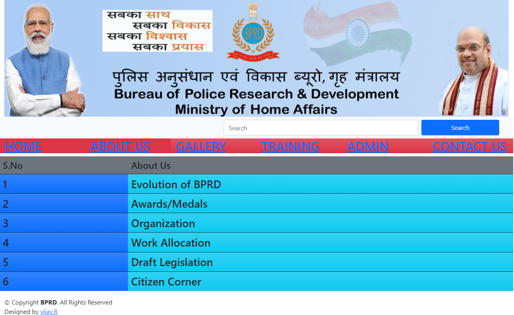
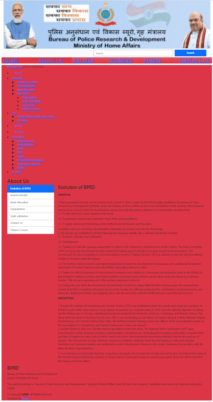
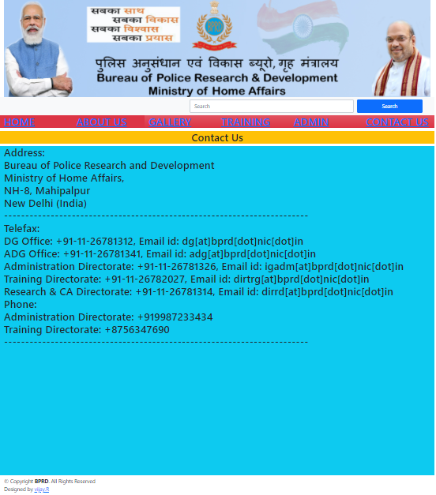

# Web Design using Bootstrap Framework

## AIM:
To design a website using bootstrap framework.

## DESIGN STEPS:

### Step 1:

Requirement collection.

### Step 2:

Creating the layout using bootstrap grid system.

### Step 3:

Updating the sample content.

### Step 4:

Choose the appropriate style and color scheme.

### Step 5:

Validate the layout in various browsers.

### Step 6:

Validate the HTML code.

### Step 6:

Publish the website in the given URL.

## PROGRAM :

### home page:
```
<!DOCTYPE html>
<html lang="en">
<head>
    <meta charset="UTF-8">
    <meta http-equiv="X-UA-Compatible" content="IE=edge">
    <meta name="viewport" content="width=device-width, initial-scale=1.0">
    <title>Bootstrap Website</title>
    <link href="https://cdn.jsdelivr.net/npm/bootstrap@5.0.2/dist/css/bootstrap.min.css" rel="stylesheet" integrity="sha384-EVSTQN3/azprG1Anm3QDgpJLIm9Nao0Yz1ztcQTwFspd3yD65VohhpuuCOmLASjC" crossorigin="anonymous">
<script src="https://cdn.jsdelivr.net/npm/bootstrap@5.0.2/dist/js/bootstrap.bundle.min.js" integrity="sha384-MrcW6ZMFYlzcLA8Nl+NtUVF0sA7MsXsP1UyJoMp4YLEuNSfAP+JcXn/tWtIaxVXM" crossorigin="anonymous"></script>
<link href="./vendor/bootstrap/css/bootstrap.min.css" rel="stylesheet">
  <link href="./vendor/bootstrap-icons/bootstrap-icons.css" rel="stylesheet">
  <link href="./vendor/boxicons/css/boxicons.min.css" rel="stylesheet">
  <link href="./vendor/glightbox/css/glightbox.min.css" rel="stylesheet">
  <link href="./vendor/swiper/swiper-bundle.min.css" rel="stylesheet">
  <link href="./css/style.css" rel="stylesheet">
<style>
    .nav-tabs
 {
   border-color:rgb(134, 15, 201);
   width:40%;
 }

.nav-tabs > li a { 
    border: 1px solid #681234;
    background-color:#d273e6; 
    color:#fff;
    }

.nav-tabs > li.active > a,
.nav-tabs > li.active > a:focus,
.nav-tabs > li.active > a:hover{
    background-color:#D6E6F3;
    color:#000;
    border: 1px solid #b05fe6;
    border-bottom-color: transparent;
    }

.nav-tabs > li > a:hover{
  background-color: #1ab8bb !important;
    border-radius: 5px;
    color:#000;

} 
.btn:hover {
  background-color: Royal blue;
}
</style>
</head>
<body>
    <div class="container">
        <div class="row">
            
            <nav class="navbar navbar-expand-sm bg-light navbar-light">
                <div class="container">

                    <button class="btn"><i class="fa fa-twitter" style="font-size:36px"></i></button>
                    <button class="btn"><i class="fa fa-youtube-play" style="font-size:36px"></i></button>
                    <button class="btn"><i class="fa fa-instagram" style="font-size:36px"></i></button>
                    <button class="btn"><i class="fa fa-envelope" style="font-size:36px"></i></button>
                    


                
                    <form class=" d-flex">
                        <input class="form-control me-2" type="text" placeholder="Search" style="width: 500px; height: 40px">
                        <button class="btn btn-primary " type="button" style="width: 200px; height: 40px">Search</button>
                      </form>
                </div>
              </nav>
            <div class="col-sm-2 h2  bg-danger "><a href="/static/homepage.html">HOME</a></div>
            <div class="col-sm-2 h2  bg-danger"><a href="/static/aboutus.html">ABOUT US</a></div>
            <div class="col-sm-2 h2  bg-danger bg-gradient"><a href="/static/pagethree.html">GALLERY</a></div>
            <div class="col-sm-2 h2  bg-danger bg-gradient"><a href="/static/pagefour.html">TRAINING</a></div>
            <div class="col-sm-2 h2  bg-danger bg-gradient"><a href="/static/pagefive.html">ADMIN</a></div>
            <div class="col-sm-2 h2  bg-danger bg-gradient"><a href="/static/contactus.html">CONTACT US</a></div>
            <table class="table">
                <thead>
                    <tr>
                        <th  class="h4 bg-secondary" scope="col">S.No</th>
                        <th class="h4 bg-secondary" scope="col">About Us</th>
                    </tr>
                <tbody>
                    <tr scope="row"></tr>
                    <td class="col-sm-3 h3 bg-primary bg-gradient">1</td>
                    <td class="col-sm-9 h3 bg-info bg-gradient">Evolution of BPRD</td>
    
                </tbody>
                <tbody>
                    <tr scope="row"></tr>
                    <td class=" col-sm-3 h3 bg-primary bg-gradient">2</td>
                    <td class=" col-sm-9 h3 bg-info bg-gradient">Awards/Medals</td>
                </tbody>
                <tbody>
                    <tr scope="row"></tr>
                    <td class=" col-sm-3 h3 bg-primary bg-gradient">3</td>
                    <td class=" col-sm-9 h3 bg-info bg-gradient">Organization</td>
                </tbody>
            <tbody>
                <tr scope="row"></tr>
                <td class="col-sm-3 h3 bg-primary bg-gradient">4</td>
                <td class="col-sm-9 h3 bg-info bg-gradient">Work Allocation</td>
            </tbody>
            <tbody>
                <tr scope="row"></tr>
                <td class=" col-sm-3 h3 bg-primary bg-gradient">5</td>
                <td class=" col-sm-9 h3 bg-info bg-gradient">Draft Legislation</td>
            </tbody>
            <tbody>
                <tr scope="row"></tr>
                <td class=" col-sm-3 h3 bg-primary bg-gradient">6</td>
                <td class=" col-sm-9 h3 bg-info bg-gradient">Citizen Corner</td>
            </tbody>

                </thead>
            </table>
            <div class="copyright">
                &copy; Copyright <strong><span>BPRD</span></strong>. All Rights Reserved
              </div>
              <div class="credits">
                Designed by <a href="https://bootstrapmade.com/">vijay.R</a>
              </div>
            </div>
          </footer><!-- End Footer -->
        </div>
        </body>
</html>


```

### about page:
```
<!DOCTYPE html>
<html lang="en">
<head>
    <meta charset="UTF-8">
    <meta http-equiv="X-UA-Compatible" content="IE=edge">
    <meta name="viewport" content="width=device-width, initial-scale=1.0">
    <title>Bootstrap Website</title>
    <link href="https://cdn.jsdelivr.net/npm/bootstrap@5.0.2/dist/css/bootstrap.min.css" rel="stylesheet" integrity="sha384-EVSTQN3/azprG1Anm3QDgpJLIm9Nao0Yz1ztcQTwFspd3yD65VohhpuuCOmLASjC" crossorigin="anonymous">
<script src="https://cdn.jsdelivr.net/npm/bootstrap@5.0.2/dist/js/bootstrap.bundle.min.js" integrity="sha384-MrcW6ZMFYlzcLA8Nl+NtUVF0sA7MsXsP1UyJoMp4YLEuNSfAP+JcXn/tWtIaxVXM" crossorigin="anonymous"></script>
<link href="./vendor/bootstrap/css/bootstrap.min.css" rel="stylesheet">
  <link href="./vendor/bootstrap-icons/bootstrap-icons.css" rel="stylesheet">
  <link href="./vendor/boxicons/css/boxicons.min.css" rel="stylesheet">
  <link href="./vendor/glightbox/css/glightbox.min.css" rel="stylesheet">
  <link href="./vendor/swiper/swiper-bundle.min.css" rel="stylesheet">
  <link href="./css/style.css" rel="stylesheet">
<style>
    .nav-tabs
 {
   border-color:rgb(140, 12, 199);
   width:40%;
 }

.nav-tabs > li a { 
    border: 1px solid #68034f;
    background-color:#d273e6; 
    color:#fff;
    }

.nav-tabs > li.active > a,
.nav-tabs > li.active > a:focus,
.nav-tabs > li.active > a:hover{
    background-color:#D6E6F3;
    color:#000;
    border: 1px solid #b05fe6;
    border-bottom-color: transparent;
    }

.nav-tabs > li > a:hover{
  background-color: #1ab8bb !important;
    border-radius: 5px;
    color:#000;

} 
.btn:hover {
  background-color: RoyalBlue;
}
</style>
</head>
<body>
    <div class="container">
        <div class="row">
            
            <nav class="navbar navbar-expand-sm bg-light navbar-light">
                <div class="container">

                    <button class="btn"><i class="fa fa-twitter" style="font-size:36px"></i></button>
                    <button class="btn"><i class="fa fa-youtube-play" style="font-size:36px"></i></button>
                    <button class="btn"><i class="fa fa-instagram" style="font-size:36px"></i></button>
                    <button class="btn"><i class="fa fa-envelope" style="font-size:36px"></i></button>
                    


                
                    <form class=" d-flex">
                        <input class="form-control me-2" type="text" placeholder="Search" style="width: 500px; height: 40px">
                        <button class="btn btn-primary " type="button" style="width: 200px; height: 40px">Search</button>
                      </form>
                </div>
              </nav>
            <div class="col-sm-2 h2  bg-danger "><a href="/static/homepage.html">HOME</a></div>
            <div class="col-sm-2 h2  bg-danger"><a href="/static/aboutus.html">ABOUT US</a></div>
            <div class="col-sm-2 h2  bg-danger bg-gradient"><a href="/static/pagethree.html">GALLERY</a></div>
            <div class="col-sm-2 h2  bg-danger bg-gradient"><a href="/static/pagefour.html">TRAINING</a></div>
            <div class="col-sm-2 h2  bg-danger bg-gradient"><a href="/static/pagefive.html">ADMIN</a></div>
            <div class="col-sm-2 h2  bg-danger bg-gradient"><a href="/static/contactus.html">CONTACT US</a></div>
            <div class="bg-danger">
            <!-- ======= Top Bar ======= -->
  <section id="topbar" class="d-flex align-items-center">
    <div class="container d-flex justify-content-center justify-content-md-between">
      <div class="contact-info d-flex align-items-center">
        <i class="bi bi-envelope-fill"></i><a href="mailto:dg.brpd.nic.in">dg.brpd.nic.in</a>
        <i class="bi bi-phone-fill phone-icon"></i>+91-11-26781312
      </div>
      <div class="social-links d-none d-md-block">
        <a href="#" class="twitter"><i class="bi bi-twitter"></i></a>
        <a href="#" class="facebook"><i class="bi bi-facebook"></i></a>
        <a href="#" class="instagram"><i class="bi bi-instagram"></i></a>
        <a href="#" class="linkedin"><i class="bi bi-linkedin"></i></i></a>
      </div>
    </div>
  </section>

  <!-- ======= Header ======= -->
  <header id="header" class="d-flex align-items-center">
    <div class="container d-flex align-items-center">
      
      <nav id="navbar" class="navbar">
        <ul>
          <li><a class="nav-link scrollto active" href="./index.html">Home</a></li>
          <li class="dropdown"><a href="./aboutus.html"><span>About Us</span> <i class="bi bi-chevron-down"></i></a>
            <ul>
              <li><a href="./aboutus.html">Evolution of BPRD</a></li>
              <li><a href="#">Awards/Medals</a></li>
              <li><a href="#">Work Allocation</a></li>
              <li class="dropdown"><a href="#"><span>View More</span> <i class="bi bi-chevron-right"></i></a>
                <ul>
                  <li><a href="#">Organization</a></li>
                  <li><a href="#">Draft Legislation</a></li>
                  <li><a href="#">Contact Us</a></li>
                  <li><a href="#">Citizen's Corner</a></li>
                </ul>
              </li>
            </ul>
            <li class="dropdown"><a href="./spc.html"><span>SPC</span> <i class="bi bi-chevron-down"></i></a>
              <ul>
                <li><a href="./spc.html">Student Police Cadet Programme</a></li>
                <li><a href="#">SPC Web</a></li>
              </ul>
          <li><a class="nav-link scrollto " href="./index.html#portfolio">Gallery</a></li>
          <li><a class="nav-link scrollto" href="#team">Training</a></li>
          <li class="dropdown"><a href="#"><span>View More</span> <i class="bi bi-chevron-down"></i></a>
            <ul>
              <li><a href="#">Research & CA</a></li>
              <li><a href="#">Modernization</a></li>
              <li><a href="#">NPM</a></li>
              <li><a href="#">SPD</a></li>
              <li><a href="#">Admin</a></li>
              <li><a href="#">SP Conf. & Police Expo</a></li>
              <li><a href="#">Publication/ Reports</a></li>
              <li><a href="#">DOPO</a></li>
            </ul>
          </li>
          <li><a class="getstarted scrollto" href="./index.html#contact">Contact</a></li>
        </ul>
        <i class="bi bi-list mobile-nav-toggle"></i>
      </nav><!-- .navbar -->
    </div>
  </header><!-- End Header -->
  
  <!-- ======= About Us Section ======= -->
<section id="about" class="about">
    <div class="container">

      <div class="section-title">
        <h2>About Us</h2>
      </div>

      <div class="row">
        <div class="col-lg-3 order-1 order-lg-1">
          <div class="list-group">
            <button type="button" class="list-group-item list-group-item-action active">Evolution of BPRD</button>
            <button type="button" class="list-group-item list-group-item-action">Awards/Medals</button>
            <button type="button" class="list-group-item list-group-item-action">Work Allocation</button>
            <button type="button" class="list-group-item list-group-item-action">Organization</button>
            <button type="button" class="list-group-item list-group-item-action">Draft Lefislation</button>
            <button type="button" class="list-group-item list-group-item-action">Contact Us</button>
            <button type="button" class="list-group-item list-group-item-action">Citizen's Corner</button>
          </div>
        </div>
        <div class="col-lg-9 pt-4 pt-lg-0 order-2 order-lg-1 content">
          <h3>Evolution of BPRD</h3>
          <p class="fst-italic">
              <dl>
                <dt>CREATION</dt>
                <br>1.The Government of India vied Resolution No.8/136/68-P.I (Pers.I) dated 28.08.1970 formally established the Bureau of Police Research and Development (BPR&D), under the Ministry of Home Affairs giving a new orientation to then existing Police Research and Advisory Council (1966) for the following reasons and with the primary objective of modernization of police force:
                <dd>1.1. To take direct and active interest in the issues</dd>
                <dd>1.2. To promote a speedy and systematic study of the police problems,</dd>
                <dd>1.3. To apply science and technology in the methods and techniques used by police.</dd>
                In addition and as a secondary, the Resolution mandated an advisory role also for the Bureau.<br>
                2. The Bureau was established with the following two divisions initially with a well laid out charter of duties
                <dd>2.1. Research, Statistics and Publication</dd>
                <dd>2.2. Development</dd>
                <dd>2.3. Training is a vital and growing requirement to improve the competency of police forces in the country. The Gore-Committee (1971) set up by the Government of India studied the training aspects of police and gave several recommendations. The government of India in accepting its recommendations created a Training Division (1973) in addition to the two divisions already existing to function under the Bureau.</dd>
                <dd>2.4. The forensic science services uncompromising & Geese under the Development Division grew over a period and a separate Directorate of Forensic Sciences under the BPR&D came into existence in 1983.</dd>
                <dd>2.5. Further in 1995 Government of India decided to entrust issues relating to Correctional Administration Work to the BPR&D so that problems relating to prisons and implementation of deemed prison reforms can be taken up by the Bureau in a cohesive manner. This set up is operating out of the existing manpower resources.</dd>
                <dd>2.6. During the year 2008, the Government of India further decided to create National Police Mission under the administrative control of BPR&D to transform the police forces in the country into effective instrument for maintenance of internal security and facing the challenges in future, by equipping them with the necessary material, intellectual and organizational resources.</dd>
                <dt>SEPARATION</dt>
                <br>1.Though the Institute of Criminology and Forensic Science (ICFS) was established under the overall supervision and guidance of BPR&D as part of the same exercise, it was allowed to function as a separate entity in 1976; since the ultimate objective of setting up the Institute was to develop a full-fledged academic institution for furthering studies in Criminology and forensic science. The same which has been re-christened in the year 1991 is now functioning as Lok Nayak Jai Prakash Narayan (LNJN), National Institute of Criminology and Forensic Science from 1982. The institute provides training courses for officers of the criminal justice system in the two subjects i.e. Criminology and Forensic Science and carries out research.
                <dd>2. Growth dynamics took over and the need to specialize in each area arose. The National Police Commission (1977) also recommended certain measures requiring implementation. Simultaneously, technological innovations particularly computers held promises of support to many areas of crime control and crime detection besides processing statistical data for the purpose of analysis. The Government of India, therefore, decided to establish a National Crime Records Bureau in 1986 build another Resolution and entrusted statistics and publications work of the Research Division to the newly constituted Bureau along with the plans for their computerization.</dd>
                <dd>3. In an identical move brought about by compulsions of growth, the Government of India decided to give an independent status to the Forensic Science Division by creating a Forensic Science Directorate having an autonomous status under the direct control of the Ministry of Home Affairs.</dd>
              </dl>
          </p>
        </div>
      </div>
    </div>
  </section><!-- End About Us Section -->

  <!-- ======= Footer ======= -->
  <footer id="footer">
    <div class="container">
      <h3>BPRD</h3>
      <p>Bureau of Police Research and Development <br> A part of Ministry Of Home</p>
      <p>This website belongs to "Bureau of Police Research and Development", Ministry of Home Affairs, Govt. Of India Site Designed, Developed and Hosted by National Informatics Centre</p>
      <div class="social-links">
        <a href="#" class="twitter"><i class="bx bxl-twitter"></i></a>
        <a href="#" class="facebook"><i class="bx bxl-facebook"></i></a>
        <a href="#" class="instagram"><i class="bx bxl-instagram"></i></a>
        <a href="#" class="linkedin"><i class="bx bxl-linkedin"></i></a>
      </div>
      <div class="copyright">
        &copy; Copyright <strong><span>BPRD</span></strong>. All Rights Reserved
      </div>
      <div class="credits">
        Designed by <a href="https://bootstrapmade.com/">vijay.R</a>
      </div>
    </div>
  </footer><!-- End Footer -->
            </div>
        </body>
</html>


```
### contact us page:
```
<!DOCTYPE html>
<html lang="en">
<head>
    <meta charset="UTF-8">
    <meta http-equiv="X-UA-Compatible" content="IE=edge">
    <meta name="viewport" content="width=device-width, initial-scale=1.0">
    <title>Bootstrap Website</title>
    <link href="https://cdn.jsdelivr.net/npm/bootstrap@5.0.2/dist/css/bootstrap.min.css" rel="stylesheet" integrity="sha384-EVSTQN3/azprG1Anm3QDgpJLIm9Nao0Yz1ztcQTwFspd3yD65VohhpuuCOmLASjC" crossorigin="anonymous">
<script src="https://cdn.jsdelivr.net/npm/bootstrap@5.0.2/dist/js/bootstrap.bundle.min.js" integrity="sha384-MrcW6ZMFYlzcLA8Nl+NtUVF0sA7MsXsP1UyJoMp4YLEuNSfAP+JcXn/tWtIaxVXM" crossorigin="anonymous"></script>
<link href="./vendor/bootstrap/css/bootstrap.min.css" rel="stylesheet">
  <link href="./vendor/bootstrap-icons/bootstrap-icons.css" rel="stylesheet">
  <link href="./vendor/boxicons/css/boxicons.min.css" rel="stylesheet">
  <link href="./vendor/glightbox/css/glightbox.min.css" rel="stylesheet">
  <link href="./vendor/swiper/swiper-bundle.min.css" rel="stylesheet">
  <link href="./css/style.css" rel="stylesheet">
<style>
    .nav-tabs
 {
   border-color:rgb(140, 12, 199);
   width:40%;
 }

.nav-tabs > li a { 
    border: 1px solid #68034f;
    background-color:#d273e6; 
    color:#fff;
    }

.nav-tabs > li.active > a,
.nav-tabs > li.active > a:focus,
.nav-tabs > li.active > a:hover{
    background-color:#D6E6F3;
    color:#000;
    border: 1px solid #b05fe6;
    border-bottom-color: transparent;
    }

.nav-tabs > li > a:hover{
  background-color: #1ab8bb !important;
    border-radius: 5px;
    color:#000;

} 
.btn:hover {
  background-color: RoyalBlue;
}
</style>
</head>
<body>
    <div class="container">
        <div class="row">
            
            <nav class="navbar navbar-expand-sm bg-light navbar-light">
                <div class="container">

                    <button class="btn"><i class="fa fa-twitter" style="font-size:36px"></i></button>
                    <button class="btn"><i class="fa fa-youtube-play" style="font-size:36px"></i></button>
                    <button class="btn"><i class="fa fa-instagram" style="font-size:36px"></i></button>
                    <button class="btn"><i class="fa fa-envelope" style="font-size:36px"></i></button>
                    


                
                    <form class=" d-flex">
                        <input class="form-control me-2" type="text" placeholder="Search" style="width: 500px; height: 40px">
                        <button class="btn btn-primary " type="button" style="width: 200px; height: 40px">Search</button>
                      </form>
                </div>
              </nav>
            <div class="col-sm-2 h2  bg-danger "><a href="/static/homepage.html">HOME</a></div>
            <div class="col-sm-2 h2  bg-danger"><a href="/static/aboutus.html">ABOUT US</a></div>
            <div class="col-sm-2 h2  bg-danger bg-gradient"><a href="/static/pagethree.html">GALLERY</a></div>
            <div class="col-sm-2 h2  bg-danger bg-gradient"><a href="/static/pagefour.html">TRAINING</a></div>
            <div class="col-sm-2 h2  bg-danger bg-gradient"><a href="/static/pagefive.html">ADMIN</a></div>
            <div class="col-sm-2 h2  bg-danger bg-gradient"><a href="/static/contactus.html">CONTACT US</a></div>
            <h2 class="text-center bg-warning">Contact Us</h2>
            <div class="h2 bg-info" style="height:1000px;">
                Address:</br>
             
                Bureau of Police Research and Development</br>
                Ministry of Home Affairs,</br>
                NH-8, Mahipalpur</br>
                New Delhi (India)</br>
                ------------------------------------------------------------------------</br>

                Telefax:</br>
                DG Office: +91-11-26781312, Email id: dg[at]bprd[dot]nic[dot]in</br>
                ADG Office: +91-11-26781341, Email id: adg[at]bprd[dot]nic[dot]in</br>
                Administration Directorate: +91-11-26781326, Email id: igadm[at]bprd[dot]nic[dot]in</br>
                Training Directorate: +91-11-26782027, Email id: dirtrg[at]bprd[dot]nic[dot]in</br>
                Research & CA Directorate: +91-11-26781314, Email id: dirrd[at]bprd[dot]nic[dot]in</br>
                Phone:</br>
                Administration Directorate: +919987233434</br>
                Training Directorate: +8756347690</br>
                ------------------------------------------------------------------------</br>
                
            
            
            </div>
            <div class="copyright">
                &copy; Copyright <strong><span>BPRD</span></strong>. All Rights Reserved
              </div>
              <div class="credits">
                Designed by <a href="https://bootstrapmade.com/">vijay.R</a>
              </div>
            </div>
          </footer><!-- End Footer -->
                    </div>
                </body>
        </html>

```

## OUTPUT:


### Home Page:


### about us page:


### contact us page:



## Result:

Thus the website is created using bootstrap.

